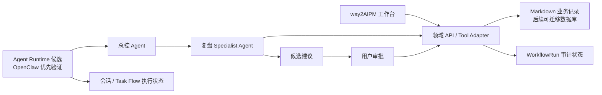

# way2AIPM OS Agent Runtime 技术决策

## 决策状态

- 状态：`Proposed`，待 `v0.23` 可行性验证后确认采用方案。
- 日期：`2026-05-26`。
- 影响范围：`v0.23+` Agent Runtime、工具权限、流程执行与未来技术选型。

## 背景

`way2AIPM OS` 的产品结构容易被描述为“总控 Agent 调度多个模块 Agent”，但这里需要区分两类责任：

- Pipeline、复盘、缺陷、训练、节奏等模块首先是业务记录与工作台，不应为了 Agent 化而改造成自主执行者。
- 总控调度、面试前准备、面试后诊断和训练计划等环节，确实可能受益于具备工具调用能力的专项 Agent。

v0.22 已实现 `WorkflowRun` 与面试后修复闭环。它记录真实业务状态、人工审批结果和时间线。后续需要解决的问题不是重新发明领域流程，而是：是否可以使用成熟的开源 Agent Runtime 承担会话、工具调用、子 Agent 委派和可恢复执行。

## 决策

采取以下技术方向：

1. 保留 v0.22 的 `WorkflowRun`、领域数据与人工审批边界，它们属于 `way2AIPM OS` 的产品事实层。
2. 将 Agent Runtime 从“默认自行使用 LangGraph 实现”调整为“优先验证现成开源运行时”。
3. `v0.23` 首选验证 **OpenClaw**，因为其官方能力中同时包含多 Agent 路由、子 Agent 与可持久化的 `Task Flow`/审批执行路径，与现有修复闭环最接近。
4. **Hermes Agent** 作为候选运行时保留，用于对照长期个人 Agent、记忆、工具集与 delegation 能力；本阶段不并行接入两个 Runtime。
5. **LangGraph** 暂不作为默认迁移路线。只有当现成 Runtime 无法满足领域状态映射、审批恢复或部署边界时，再以自定义编排备选方案评估。

## 模块与 Agent 边界

不是每个 OS 模块都应成为独立 Agent。首阶段采用“领域模块 + 少量专项 Agent”的方式：

| 当前模块 | 首阶段角色 | 说明 |
| --- | --- | --- |
| `00_总控调度器` | `Orchestrator Agent` 候选 | 理解当前待办，选择可调用专项能力，不直接写入事实数据 |
| `01_求职项目管理中台` | 领域服务与工作台 | 管理 Pipeline、风险与进度，不单独自主运行 |
| `02_面试前作战室` | 后续 `Preparation Specialist` 候选 | JD 拆解、问题预测与 Brief 建议 |
| `03_面试后复盘室` | 首个 `Review Specialist` 候选 | 复盘诊断与修复建议 |
| `04_项目弹药库` | 领域资产库 | 供专项 Agent 只读检索并提出引用建议 |
| `05_能力缺陷档案` | 领域事实库 | 写入必须经过人工采纳 |
| `06_训练计划中心` | 领域服务，后续专项能力 | 训练任务提案和推进状态 |
| `07_AI前沿思维框架` | 知识资产库 | 后续作为只读上下文 |
| `08_作品集产品线` | 展示与内容资产 | 暂不交给 Agent 自动发布 |
| `09_个人节奏运营官` | 领域记录，后续提醒能力 | 暂不主动干预工作流 |
| `10_表达稳定性训练室` | 领域服务，后续专项能力 | 承接训练结果与验证 |

## 目标架构边界

边界约束：

- `way2AIPM OS` 持有业务实体与 `WorkflowRun` 的最终事实。
- Runtime 可以持有会话、执行过程、子 Agent 任务和检查点，但不是业务真相来源。
- Agent 只能通过受控工具/API 读取记录或提交候选，不能直接拥有 Markdown 目录写权限。
- 创建缺陷、创建训练任务、完成闭环、公开发布或删除数据等动作，必须保留显式人工批准。

## 候选方案判断

### OpenClaw：优先验证

依据官方文档，OpenClaw 已提供：

- 多 Agent routing，可用独立 workspace、session 和工具配置隔离不同 Agent。
- sub-agents，可从当前执行中派发子任务。
- `Task Flow`，用于持久化多步骤流程，并可跟踪状态、修订和重启后的恢复。
- 通过 `Lobster` 执行确定性流程与 approval gates，使流程在关键动作前暂停等待批准。

它与 `post_interview_repair_loop` 的对应关系如下：

| 当前能力 | OpenClaw 验证点 |
| --- | --- |
| 总控调度入口 | 一个 Orchestrator Agent 是否可以选择复盘专项能力 |
| 复盘诊断 | Review Specialist 是否可以调用只读工具并输出结构化候选 |
| `WorkflowRun` 状态 | Task Flow 状态是否能稳定映射回业务流程记录 |
| 候选采纳 | approval gate 是否能停在人工确认前 |
| 恢复执行 | 服务重启或等待后是否能继续同一流程 |

需要特别防范的边界：

- OpenClaw 官方提示 workspace 是默认工作目录，并非硬安全边界；因此验证必须配置 sandbox 与工具 allow/deny。
- OpenClaw 的流程状态不可替代业务数据；必须定义单向或幂等同步策略。
- 当前本地开发位于 Windows，验证阶段需确认原生环境或 WSL2 的可用成本。

### Hermes Agent：候选保留

依据官方仓库与架构文档，Hermes Agent 提供工具调用、Toolsets、`delegate_task` 子 Agent 委派、SQLite 会话/记忆、MCP 与插件扩展等能力。它适合进一步探索：

- 跨会话的个人成长记忆。
- Skills/工具生态对个人 Agent 的支持。
- 主 Agent 向专项任务委派的体验。

当前不将其设为首个集成对象，原因是本阶段核心验证目标是现有 `WorkflowRun` 的审批闭环与可恢复流程，而 OpenClaw 的 `Task Flow` 与这一目标更加直接对应。

### LangGraph：条件性备选

LangGraph 仍然是自定义流程图、interrupt 和 checkpoint 的可选实现方式，但不再是既定下一步。仅在以下情况出现时启动验证：

- OpenClaw/Hermes 无法与领域 API 建立受控工具边界。
- 外部 Runtime 的流程状态无法可靠关联 `WorkflowRun`。
- 审批恢复、失败重试或部署方案不能满足本地使用要求。
- 需要极深的流程节点定制，而通用 Runtime 的扩展成本高于自建图执行。

## v0.23 验证范围

v0.23 只做可行性验证和最小适配，不做全面迁移：

- 建立 OpenClaw 的本地运行方式与安全配置结论。
- 建立一个总控 Agent 和一个面试后复盘专项 Agent 的最小实验。
- 暴露只读工具或模拟 Tool Adapter：读取复盘与当前 `WorkflowRun`。
- 输出缺陷/训练候选提案，但不允许 Runtime 直接写入 Markdown。
- 尝试将一条 `post_interview_repair_loop` 映射到 `Task Flow`，验证人工审批前暂停和恢复。
- 记录 Windows/WSL2、密钥管理、状态同步与错误恢复成本。

v0.23 不做：

- 不替换现有页面和 v0.22 Workflow 实现。
- 不将全部业务模块 Agent 化。
- 不允许 Runtime 自动创建或修改真实业务记录。
- 不同时引入 OpenClaw、Hermes 与 LangGraph 三套依赖。

## 通过标准

只有同时满足以下标准，才在后续版本采用 OpenClaw 作为 Runtime：

- 可在本地可靠启动，并给出用户可重复的运行配置。
- Agent 只能访问明确允许的读取/提案工具，不能越过审批修改业务记录。
- 可将一次复盘闭环与唯一 `WorkflowRun` 可靠关联。
- 可在等待人工决定时暂停，并在决定后继续执行。
- 状态同步、错误处理与开发复杂度明显低于自行实现运行时。

若无法满足，通过 v0.23 结论决定验证 Hermes 或回到 LangGraph 自定义编排，而不是强行继续集成。

## 影响

正面影响：

- 避免在业务闭环尚未充分使用前自行维护通用 Agent 基础设施。
- v0.22 已完成的状态模型仍然有效，不会因运行时替换而返工。
- 后续 Agent 能力由真实验证数据驱动，而不是先决定框架再适配产品。

成本与风险：

- v0.23 将是验证版本，不会立刻带来新的最终用户功能。
- 需要处理 Runtime 与本系统之间的双状态关联。
- 外部 Runtime 的安装、安全配置和 Windows 使用体验需要实测确认。

## 官方参考

- [OpenClaw GitHub](https://github.com/openclaw/openclaw)
- [OpenClaw Multi-Agent Routing](https://docs.openclaw.ai/concepts/multi-agent)
- [OpenClaw Sub-Agents](https://docs.openclaw.ai/tools/subagents)
- [OpenClaw Task Flow](https://docs.openclaw.ai/automation/taskflow)
- [Hermes Agent GitHub](https://github.com/NousResearch/hermes-agent)
- [Hermes Agent Architecture](https://hermes-agent.nousresearch.com/docs/developer-guide/architecture)
- [Hermes Agent Tools and Toolsets](https://hermes-agent.nousresearch.com/docs/user-guide/features/tools)
- [LangGraph Workflows and Agents](https://docs.langchain.com/oss/javascript/langgraph/workflows-agents)
