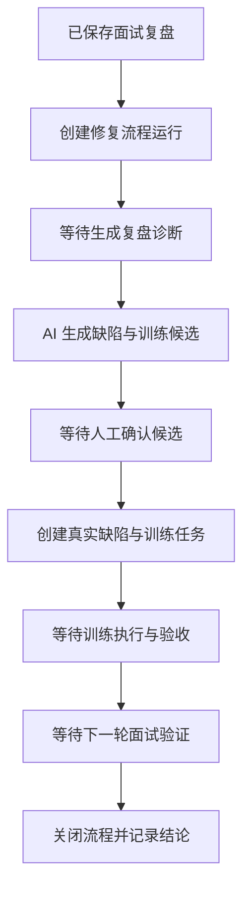

# way2AIPM OS Agent + Workflow Architecture

## 目的

`way2AIPM OS` 不应成为一组散落的 AI 按钮。它应逐步演进为一个能识别求职状态、推进任务、在关键写入前等待用户决策的个人 Agent OS。

本架构首先定义业务工作流与执行边界，再决定何时使用 Agent 框架。当前技术原则是：

- 业务流程先于模型能力。
- Workflow 负责确定性的状态推进与审批卡点。
- Agent 负责需要推理、归纳、规划或工具选择的步骤。
- AI 生成的是建议或动作提案；关键业务写入必须经人工确认。
- v0.22 继续使用 Node 原生服务与 Markdown 存储，不引入 LangGraph 依赖。

## 为什么先做 Workflow

目前系统已经具备：

- 求职 Pipeline、面试、复盘、缺陷、训练与表达验证等领域记录。
- 总控调度与跨模块待办。
- 复盘诊断 AI 调用、结构化候选与人工采纳。

缺少的是“一次闭环正在运行到哪里”的一级对象。没有 Workflow Run 时，用户需要自行在多个模块间判断下一步，AI 也只能停留在单点辅助功能。

Workflow 层将回答：

- 哪个真实事件启动了一条流程。
- 当前流程处于哪个步骤。
- 正在等待用户、AI 还是业务结果。
- 哪些建议已经确认并生成真实业务记录。
- 训练之后是否完成下一轮验证。

## 概念边界

| 概念 | 责任 | 本项目例子 |
| --- | --- | --- |
| Domain Record | 保存真实业务事实 | `InterviewReview`、`Weakness`、`TrainingTask` |
| Event | 表示已经发生的业务变化 | `review_ready`、`weakness_accepted`、`training_validated` |
| Workflow Definition | 描述可重复执行的流程图 | `post_interview_repair_loop` |
| Workflow Run | 某个对象上的一次具体流程运行 | 某公司一面复盘后的修复闭环 |
| Step Run | 流程步骤及其执行结果 | 诊断候选已生成、等待采纳 |
| Approval Gate | 必须等待用户决定的卡点 | 将 AI 候选创建为真实缺陷 |
| Agent Tool | Agent 受控读取或提出动作的接口 | 读取复盘、建议训练任务 |

Workflow 与 Agent 的关系：

```text
Workflow = 明确步骤、状态、审批边界和可恢复执行
Agent    = 在被授权步骤内分析上下文并提出下一步动作
```

## OS 分层

```text
UI Workbench
  -> Workflow Runtime / Dispatcher
      -> Approval Policy
      -> Agent Tool Layer
      -> Domain Services
          -> Markdown Storage Adapter
          -> AI Provider
```

### Domain Services

继续维护当前真实业务实体：

- `Opportunity`
- `InterviewRound`
- `PreInterviewBrief`
- `InterviewReview`
- `Weakness`
- `TrainingTask`
- `ExpressionDrill`
- `ExpressionSession`

领域记录是事实来源，不由 Agent 自由改写。

### Workflow Runtime

负责：

- 建立和更新 `WorkflowRun`。
- 接受事件并执行合法状态转移。
- 记录执行历史、等待原因、关联实体。
- 将流程待办纳入总控调度器。

### Agent Tool Layer

负责为未来 Agent 暴露有限能力，而不是给予文件系统权限。

| 权限层级 | 工具能力 | 是否可自动执行 |
| --- | --- | --- |
| Read | 读取复盘、岗位、项目弹药、缺陷与训练记录 | 可以 |
| Analyze | 生成诊断、匹配、问题预测或计划候选 | 用户主动触发后可以 |
| Propose Write | 提议创建缺陷、训练任务、Brief 更新 | 只生成提案 |
| Commit Write | 创建或修改真实业务记录 | 必须人工确认 |
| Restricted | 删除记录、公开发布、发送外部消息 | 第一阶段不提供 |

## 第一条 Workflow

首个流程定义为 `post_interview_repair_loop`，即“面试后修复闭环”。它选择已有能力最成熟的路径，避免先扩张 AI 场景再补流程基础。



### v0.22 起点

v0.22 不自动监听所有面试事件。用户在已经保存的复盘记录上点击“开启修复流程”，创建一条 Workflow Run。这一选择可以：

- 避免尚未验证的自动化产生重复流程。
- 复用 v0.21 已完成的诊断与候选确认。
- 让用户先真实使用流程视图，再决定自动触发规则。

### 状态模型

| 状态 | 含义 | 等待动作 |
| --- | --- | --- |
| `diagnosis_pending` | 已关联复盘，尚未生成诊断候选 | 用户调用 AI 或手动解析候选 |
| `candidate_confirmation` | 已生成待确认候选 | 用户采纳或忽略候选 |
| `training_pending` | 已形成至少一条训练任务 | 用户开始训练 |
| `training_in_progress` | 训练正在推进 | 完成并验收训练 |
| `validation_pending` | 训练完成，等待真实场景验证 | 关联下一轮面试或验证记录 |
| `completed` | 已确认修复效果或关闭闭环 | 无 |
| `paused` | 用户主动暂停 | 恢复或关闭 |

流程状态不替代业务实体状态，而是从关联记录与动作历史中推进。

### 事件模型

| Event Type | 来源 | 对流程的影响 |
| --- | --- | --- |
| `workflow_started` | 用户从复盘开启流程 | 创建 Run，进入 `diagnosis_pending` |
| `diagnosis_generated` | AI 调用或手动解析成功 | 进入 `candidate_confirmation` |
| `candidate_accepted` | 用户采纳候选 | 记录生成的缺陷/训练引用 |
| `training_available` | 已产生真实训练任务 | 进入 `training_pending` |
| `training_started` | 训练状态更新 | 进入 `training_in_progress` |
| `training_validated` | 任务验收或表达稳定 | 进入 `validation_pending` |
| `workflow_completed` | 用户确认闭环结束 | 进入 `completed` |
| `workflow_paused` | 用户暂停 | 进入 `paused` |

## 数据模型

v0.22 新增本地存储目录：

```text
content/workflow-runs/{id}.md
```

建议 front matter：

```json
{
  "id": "flow_xxx",
  "type": "workflowRun",
  "definitionKey": "post_interview_repair_loop",
  "title": "示例公司 - 一面修复闭环",
  "status": "candidate_confirmation",
  "opportunityId": "opp_xxx",
  "interviewRoundId": "int_xxx",
  "reviewId": "review_xxx",
  "aiAnalysisNoteId": "ainote_xxx",
  "weaknessIds": [],
  "trainingTaskIds": [],
  "currentStep": "confirm_candidates",
  "waitingFor": "human_approval",
  "events": [
    {
      "type": "workflow_started",
      "at": "2026-05-25T00:00:00.000Z",
      "sourceId": "review_xxx"
    }
  ],
  "createdAt": "2026-05-25T00:00:00.000Z",
  "updatedAt": "2026-05-25T00:00:00.000Z"
}
```

正文记录可读时间线与闭环总结，使 Markdown 仍能直接查看。

## 审批边界

| 行为 | v0.22 策略 |
| --- | --- |
| 创建 Workflow Run | 用户主动触发 |
| 生成 AI 诊断候选 | 用户主动触发 |
| 写入缺陷记录 | 用户逐条采纳 |
| 写入训练任务 | 用户逐条采纳，且关联缺陷已采纳 |
| 更新训练状态 | 用户编辑现有记录 |
| 关闭 Workflow Run | 用户确认 |
| 删除或批量变更记录 | 不提供 |

## v0.22 轻量实现

v0.22 的目标是验证流程对象是否真正帮助日常使用，不做通用编排引擎。

### 后端

- 新增 `workflow-runs` Markdown adapter 与规范化函数。
- 新增 API：
  - `GET /api/workflow-runs`
  - `GET /api/workflow-runs/:id`
  - `POST /api/workflow-runs`
  - `PUT /api/workflow-runs/:id`
- 从已保存复盘创建 `post_interview_repair_loop` Run。
- 在 AI 候选解析、候选采纳和训练任务更新后，同步相关 Run 状态。
- 将进行中的 Run 汇总进系统快照与调度队列。

### 前端

- 在复盘详情增加“开启修复流程”入口。
- 在总控台展示流程状态、等待动作与下一步入口。
- 增加轻量 Workflow 详情视图，显示：
  - 关联复盘
  - 当前状态
  - 已生成缺陷/训练任务
  - 时间线
- 从 Workflow 详情进入已有 AI 复盘诊断工作台。

### 不做

- 不引入 LangGraph 或 LangChain。
- 不允许模型自主选择并执行写入工具。
- 不自动从所有事件创建流程实例。
- 不新增面试前 AI 生成能力。

## 迁移到 LangGraph 的映射

轻量实现中的字段应能直接映射到未来 LangGraph 概念：

| 当前抽象 | 后续 LangGraph 映射 |
| --- | --- |
| `WorkflowDefinition` | `StateGraph` 的节点与边 |
| `WorkflowRun.id` | `thread_id` |
| `status` / `currentStep` / 引用 ID | Graph State |
| `events` | 状态历史或业务审计日志 |
| `waitingFor: human_approval` | `interrupt()` |
| 人工采纳动作 | 使用 `Command` 恢复执行 |
| Markdown Run 存储 | 先保留业务审计；执行 checkpoint 可迁移到 SQLite saver |

引入 LangGraph 的条件：

- 第一条流程已被真实使用并验证步骤合理。
- 需要从等待人工审批处可靠恢复执行。
- 出现多个并行运行实例或更复杂的条件分支。
- 需要可回放的 checkpoint、失败恢复或工具执行追踪。

届时本地场景优先评估 SQLite checkpointer，而不是立刻迁移全部业务 Markdown。

## 后续 Workflow

在面试后闭环稳定后，再加入：

| 流程 | 启动事件 | Agent 价值 |
| --- | --- | --- |
| `pre_interview_preparation` | 面试已排期 | JD 拆解、问题预测、项目匹配、Brief 建议 |
| `application_prioritization` | 新增岗位或邀约 | 匹配度判断、风险提示、优先级建议 |
| `portfolio_evidence_builder` | 项目成熟或能力已验证 | 脱敏表达、证据组织、展示建议 |
| `rhythm_recovery` | 高负荷或连续失败 | 训练节奏与恢复动作建议 |

## 参考

- [LangGraph Workflows and Agents](https://docs.langchain.com/oss/javascript/langgraph/workflows-agents)
- [LangGraph Interrupts](https://docs.langchain.com/oss/javascript/langgraph/interrupts)
- [LangGraph Persistence](https://docs.langchain.com/oss/javascript/langgraph/persistence)
- [LangGraph Graph API](https://docs.langchain.com/oss/javascript/langgraph/graph-api)
