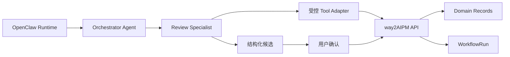

# way2AIPM OS v0.23 OpenClaw Runtime 可行性验证规格

## Summary

v0.23 不继续扩张前端模块，也不直接把现有工作流迁移到新的 Agent 框架。该版本首先验证：`way2AIPM OS` 是否可以复用 OpenClaw 作为 Agent Runtime，同时保留现有领域数据、`WorkflowRun` 和人工审批机制。

验证对象限定为第一条已落地流程：

```text
面试后复盘
  -> 复盘诊断候选
  -> 人工确认
  -> 缺陷/训练任务
  -> 训练验证
```

执行验证记录见 [v0.23 OpenClaw Runtime 验证记录](v0.23-openclaw-validation.zh.md)。

## Goals

- 明确 OpenClaw 在本地环境中的启动、配置与安全隔离方式。
- 验证“总控 Agent + 复盘专项 Agent”的最小调度形态。
- 定义 Runtime 与 `way2AIPM OS` 领域 API/工具层之间的接口边界。
- 验证 Agent 仅能读取材料并提出候选，真实写入仍由用户确认。
- 验证 OpenClaw `Task Flow` 是否适合承载 `post_interview_repair_loop` 的执行过程。
- 输出继续采用 OpenClaw、转验 Hermes 或回到 LangGraph 的工程结论。

## Non-Goals

- 不删除或重写 v0.22 的 `WorkflowRun` 实现。
- 不把 Pipeline、档案库、作品集和节奏等所有模块改造成 Agent。
- 不让外部 Runtime 直接读写 `content/` 目录。
- 不实现面试前准备 Agent 的正式产品功能。
- 不接入两个以上 Agent Runtime。
- 不改变 Markdown 存储或引入正式数据库。

## Proposed Boundary



### Runtime 负责

- Agent 会话、委派和执行上下文。
- `Task Flow` 实验运行状态。
- 工具调用过程日志与失败信息。

### way2AIPM 负责

- 复盘、缺陷、训练任务等领域记录。
- `WorkflowRun` 的业务状态与时间线。
- 所有写入型业务动作的审批和持久化。
- 页面中的最终可见结果。

## Validation Slices

### Slice 1：运行与安全基线

- 调研并记录 OpenClaw 在当前 Windows 环境及 WSL2 方案下的启动要求。
- 配置模型密钥只经本地环境配置提供，不写入代码和文档样例值。
- 明确 sandbox、workspace 与 tool allow/deny 配置方式。
- 保证验证 Runtime 不具有 `content/` 的直接写入权限。

输出：

- 安装/启动说明。
- 安全边界与不可接受配置清单。
- 继续实施或终止验证的首轮结论。

### Slice 2：受控 Tool Adapter

定义最小工具合同，优先使用 API，而不是文件系统：

| 工具 | 输入 | 输出 | 权限 |
| --- | --- | --- | --- |
| `get_interview_review` | `reviewId` | 已保存复盘内容 | Read |
| `get_workflow_run` | `workflowRunId` | 当前流程状态与关联记录 | Read |
| `propose_review_diagnosis` | 复盘上下文 | 缺陷/训练候选 JSON | Propose Write |
| `request_candidate_approval` | 候选引用 | 待用户确认信号 | Approval Gate |

写入型工具在 v0.23 不直接暴露给 Runtime；已有页面采纳动作继续负责创建真实缺陷和训练任务。

### Slice 3：Agent 调度实验

最小 Agent 结构：

| Agent | 职责 | 可调用能力 |
| --- | --- | --- |
| `orchestrator` | 根据当前流程判断需要进入复盘诊断 | 读取流程、委派专项 Agent |
| `review_specialist` | 读取复盘并提出诊断候选 | 只读工具、候选提案工具 |

验证动作：

- 从一条 `diagnosis_pending` 的 Workflow Run 发起实验。
- Orchestrator 将诊断工作交给 Review Specialist。
- Review Specialist 输出与 v0.21 schema 可兼容的候选结构。
- 候选停留在审批前，不写入缺陷/训练 Markdown。

### Slice 4：Task Flow 映射实验

尝试将已有流程的执行阶段映射为 OpenClaw Task Flow：

| `WorkflowRun` 阶段 | Runtime 实验动作 |
| --- | --- |
| `diagnosis_pending` | 调用复盘专项 Agent 生成提案 |
| `candidate_confirmation` | 进入 approval gate 并暂停 |
| `training_pending` | 由现有系统人工采纳后同步观察 |
| `validation_pending` | 读取现有训练状态，不自动关闭 |

必须验证：

- 一个 Runtime 运行只关联一个 `WorkflowRun.id`。
- 等待审批时不会写入真实业务数据。
- Runtime 恢复后不会重复产生已处理候选。
- Runtime 状态异常时，`WorkflowRun` 与领域记录仍可独立使用。

## Evaluation Matrix

| 评估项 | OpenClaw 通过条件 | 不通过后的动作 |
| --- | --- | --- |
| 本地可运行性 | 启动步骤稳定且可重复 | 记录阻塞，转验 Hermes 或自研 |
| 权限安全 | 可严格限制为读取和提案工具 | 不进入集成 |
| 审批暂停/恢复 | 流程可停在用户确认前并恢复 | 评估 LangGraph interrupt |
| 状态映射 | 可幂等关联 `WorkflowRun` | 保留现有 Runtime，不集成外部流 |
| 工程复杂度 | 低于自研调度/恢复层 | 转向更小方案 |
| Windows 使用成本 | 本地或 WSL2 体验可接受 | 作为部署阻塞记录 |

## Deliverables

- 更新后的 Agent Runtime 技术决策记录。
- OpenClaw 环境与安全验证记录。
- Tool Adapter 接口草案及只读/提案权限定义。
- 一次面试后修复流程的调度和审批实验结果。
- 运行时选型结论：`adopt_openclaw | evaluate_hermes | evaluate_langgraph | keep_manual_workflow`。

## Acceptance Criteria

- 不影响 v0.22 已有手动流程的使用。
- 没有 Runtime 直接写入业务 Markdown 的路径。
- 能展示至少一次只读复盘到结构化候选的 Agent 执行实验。
- 能明确证明审批前暂停是否成立，而不是仅凭文档推断。
- 对 OpenClaw 的采用或否决给出基于实验的理由。

## Follow-Up

- 若 OpenClaw 通过：`v0.24` 实现 Task Flow 与现有 WorkflowRun 的受控集成。
- 若 OpenClaw 不通过：`v0.24` 转为 Hermes 或 LangGraph 的有针对性对照验证。
- 仅在 Runtime 方案稳定后，再扩展面试前准备 Agent 或长期记忆能力。
